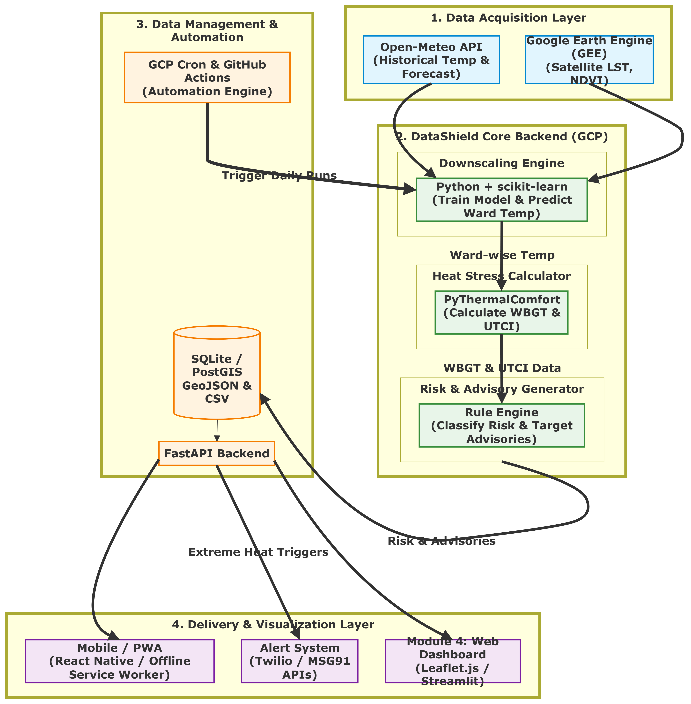

# DataShield

The official repository for SIH 2026.

DataShield is a data protection and governance solution designed to help organizations identify sensitive information, reduce exposure risk, and enforce safer handling practices across digital workflows. This repository contains the project overview, architecture diagrams, technical stack references, risk-mitigation strategy, and presentation assets for the SIH 2026 submission.

## Overview

Modern organizations handle large volumes of sensitive information across applications, internal systems, and external channels. The challenge is not only storing data securely, but also understanding where it is located, who can access it, and how it may be exposed through operational mistakes or system vulnerabilities.

DataShield addresses this by combining:

- sensitive data discovery and classification
- risk assessment and monitoring
- controlled access and policy enforcement
- operational visibility for mitigation and audit readiness

## Problem Statement

Organizations frequently struggle with:

- unclassified or poorly governed sensitive information
- weak visibility into data flow across systems
- limited detection of leakage and misuse patterns
- inconsistent controls for access and data handling
- insufficient mitigation mechanisms before a breach escalates

## Solution

DataShield provides a structured and proactive approach to data security by enabling teams to:

- identify critical and sensitive data assets
- map how data moves across the system
- detect risky patterns and vulnerabilities early
- enforce safer controls and policy decisions
- reduce the likelihood and impact of data exposure

## Key Capabilities

- Data discovery and classification
- Risk monitoring and anomaly detection
- Secure workflow and access governance
- Visual system architecture for decision makers
- Mitigation-driven design for security operations teams

## System Architecture

The architecture diagram outlines the end-to-end structure of the platform and demonstrates how data is protected, monitored, and governed.

## Process Flow

The flowcharts below explain the operational and decision-making flow of the DataShield system.

## Technical Stack

The repository includes a dedicated technical stack visualization showing the layered architecture used to implement the solution.

## Risk Mitigation

A strong risk mitigation plan is essential to reducing exposure and building a resilient data protection strategy. The project includes a dedicated risk-mitigation view highlighting likely vulnerabilities, controls, and preventive action paths.

## Repository Contents

This repository contains the core project assets, including:

- `SIH2026_26083_161620.pdf` – final project report / submission document
- `SIH2026_26083_161620.pptx` – presentation deck
- `system architecture.png` – high-level system design
- `tech stack.png` – technology stack overview
- `short flowchart.png` – simplified workflow
- `long-flowchart.png` – extended process design
- `low-level.png` – implementation-level design view
- `long-vertical.png` – vertical operational flow
- `screenshot.png` – platform or UI reference
- `gemini-code-1790499054503.xml` – auxiliary project metadata or generated output

## Project Presentation

The presentation and final proposal materials are included in the repository and can be reviewed directly in the following files:

- PDF: `SIH2026_26083_161620.pdf`
- PPTX: `SIH2026_26083_161620.pptx`

## Use Case

DataShield is suitable for environments where sensitive information must be continuously monitored, classified, and protected, including:

- enterprise data governance
- regulated and compliance-sensitive industries
- digital transformation initiatives
- internal security operations and risk teams

## Notes

This repository is structured around the SIH 2026 project submission and includes design documents, architecture assets, and presentation files. It is intended to serve as a central resource for understanding the project concept, technical direction, and mitigation strategy.

## License

This project is maintained for the SIH 2026 competition and is intended for academic and project-presentation use. Please review the repository owner and any institutional usage requirements before reuse or redistribution.
